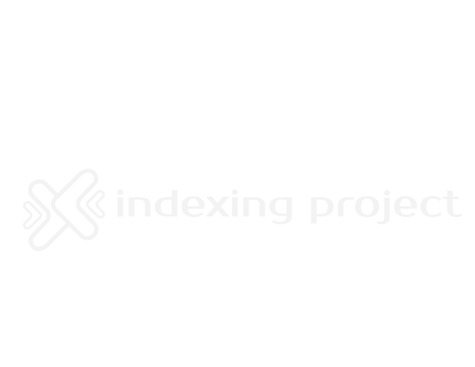

<p align="center">
  
</p>

# Modern React + Vite Template

A professional, scalable frontend template built with **React (JSX)**, **Vite**, and **Tailwind CSS**, designed to support clean architecture, modular UI development, and production-ready workflows. This project follows a **Screaming Architecture** approach combined with **Atomic Design** principles to ensure maintainability, scalability, and strong separation of concerns.

---

## 🧩 Tech Stack

* **React (JSX)** — Component-based UI development
* **Vite** — Fast build tool and development server
* **Tailwind CSS** — Utility-first styling framework
* **ESLint & Prettier** — Code quality and formatting
* **Node.js** — Runtime environment

---

## ⚙️ Node.js Version Management

It is recommended to manage Node.js versions using **NVM for Windows**:

🔗 [https://github.com/coreybutler/nvm-windows/tree/1.1.12](https://github.com/coreybutler/nvm-windows/tree/1.1.12)

Once NVM is installed, make sure to use the Node.js version compatible with this project:

```bash
nvm install [version]
nvm use [version]
```

---

## 📦 Install Dependencies

Install all required project dependencies:

```bash
npm install
```

---

## 🧑‍💻 Run in Development Mode

Start the local development server:

```bash
npm run dev
```

The application will be available at:

```
http://localhost:5173
```

---

## 🏗️ Architecture Philosophy

This template is built around two core concepts:

### 🔊 Screaming Architecture

The project structure clearly reflects **what the system does**, not just the technologies it uses. High-level concepts such as `views`, `layouts`, `routes`, and `services` are immediately visible and easy to navigate.

### ⚛️ Atomic Design

UI components are structured into:

* **Atoms** — Basic building blocks (buttons, inputs, icons)
* **Molecules** — Groups of atoms forming simple components
* **Organisms** — Complex, reusable UI sections
* **Templates** — Page-level layouts

This ensures strong reusability and consistency across the application.

---

## 📁 Recommended Project Structure

```bash
project/
├── src/
│   ├── core/                            # Core system domain
│   │   ├── assets/                     # Static project assets
│   │   │   └── images/
│   │   │       ├── icons/              # SVG / PNG icons
│   │   │       ├── banners/            # Section banners
│   │   │       ├── illustrations/      # Decorative graphics
│   │   │       └── photos/             # JPG / WebP images
│   │   │
│   │   ├── components/                # UI components (Atomic Design)
│   │   │   ├── atoms/
│   │   │   ├── molecules/
│   │   │   ├── organisms/
│   │   │   └── templates/
│   │   │
│   │   ├── contexts/                  # Base contexts
│   │   ├── providers/                # Context implementations
│   │   ├── hooks/                    # Project-specific hooks
│   │   ├── services/                # API, auth, and business logic
│   │   ├── utils/                   # Utility functions
│   │   ├── data/                    # Local data or mocks
│   │   ├── layouts/                # Main application layouts
│   │   │   ├── PublicLayout.jsx
│   │   │   ├── AuthLayout.jsx
│   │   │   └── PrivateLayout.jsx
│   │   ├── views/                  # Pages / sections
│   │   │   ├── auth/
│   │   │   ├── private/
│   │   │   └── public/
│   │   ├── routes/                # Route definitions
│   │   │   └── AppRoutes.jsx
│   │   ├── App.jsx               # Core root component
│   │   └── index.js             # Core module entry point
│   │
│   ├── shared/                  # Shared resources
│   │   ├── components/         # Common UI components
│   │   ├── hooks/              # Global hooks
│   │   ├── utils/              # Generic utilities
│   │   ├── api/                # Base API configuration
│   │   └── styles/            # Global styles
│   │
│   ├── store/                 # Global state management
│   │   ├── slices/
│   │   └── store.js
│   │
│   ├── index.css             # Global styles
│   │   └── main.jsx         # Vite / React entry point
│
├── test/                     # Test suite
│   ├── core/
│   ├── shared/
│   └── setupTests.js
│
├── libs/                     # Internal libraries (optional)
│   ├── ui-kit/              # Reusable UI components
│   ├── api-client/         # API client
│   └── utils/              # Exportable utilities
│
├── .editorconfig
├── .env
├── .gitignore
├── .node-version
├── .prettierrc
├── eslint.config.js
├── index.html
├── jsconfig.json
├── package.json
├── README.md
└── vite.config.js
```

---

## 🧪 Testing Strategy

The project supports a structured testing approach:

* **Core tests** — Business logic and domain-level functionality
* **Shared tests** — Reusable components and utilities
* **Setup configuration** — Centralized test initialization

This ensures confidence in both UI behavior and application logic.

---

## 🚀 Production Readiness

This template is designed for:

* Scalable UI architecture
* Clean separation of concerns
* Easy backend integration (REST / GraphQL / Microservices)
* Optimized asset handling
* CI/CD pipeline compatibility

---

## 📄 License & Usage

**Personal template — free to use, modify, and adapt for personal or professional projects.**

Attribution is appreciated but not required.

---

## 👤 Author

Developed as a personal, professional-grade frontend architecture template for modern web applications.

---
